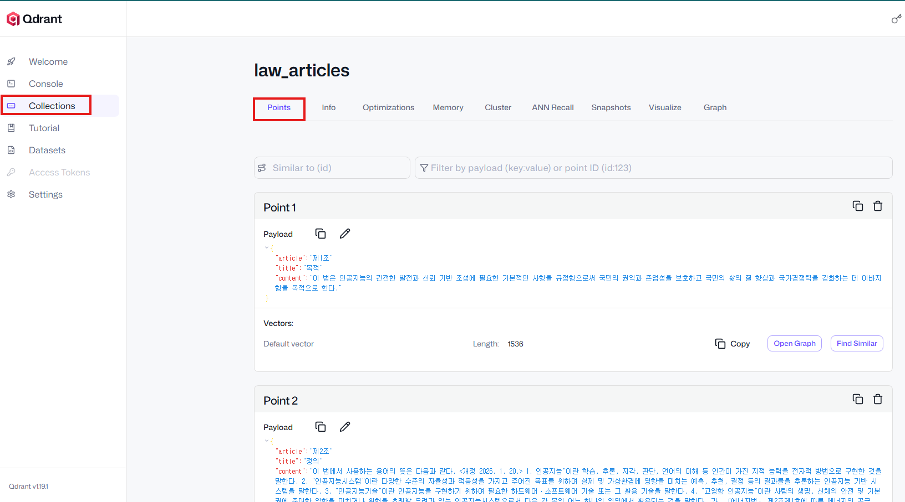

# Qdrant Vector DB 실습 가이드

WSL2에서 `docker-compose.yaml`로 Qdrant를 실행하고,  
OpenAI `text-embedding-3-small` 모델을 이용해 법률문서 더미데이터를 벡터로 저장하고 검색하는 실습이다.

---

## 1. Qdrant 실행

`docker-compose.yaml`이 있는 폴더에서 실행한다.

```bash
docker compose up -d
```

실행 상태 확인:

```bash
docker compose ps
```

Qdrant 연결 확인:

```bash
curl http://localhost:6333
```

Dashboard:

```text
http://localhost:6333/dashboard
```

종료:

```bash
docker compose down
```

---

## 2. Python 패키지 설치
`uv add`를 사용하는 경우:

```bash
uv add qdrant-client openai python-dotenv
```

`pip`를 사용하는 경우:

```bash
pip install qdrant-client openai python-dotenv
```

---

## 3. 전체 흐름

```text
법률문서
   ↓
OpenAI
text-embedding-3-small
   ↓
1536차원 Vector
   ↓
Qdrant
   ├── vector
   └── payload
        ├── law_name
        ├── article
        ├── title
        └── content
   ↓
사용자 질문
   ↓
OpenAI Embedding
   ↓
Similarity Search
   ↓
관련 조문 검색
```

---

## 빠른 실행 요약

Qdrant 실행:

```bash
docker compose up -d
```

Python 패키지 설치:

```bash
uv add qdrant-client openai python-dotenv
```

Dashboard:

```text
http://localhost:6333/dashboard
```
대시보드 화면 예시



Qdrant 종료:

```bash
docker compose down
```
